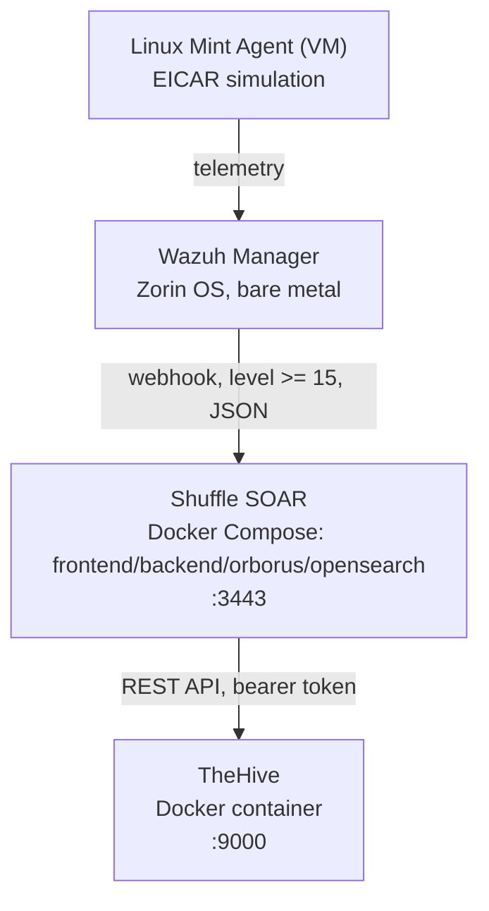

# SOAR Automation Pipeline: Wazuh SIEM, Shuffle Orchestration & TheHive Incident Response


This project extends the centralized Wazuh SIEM lab with an automated Security Orchestration, Automation, and Response (SOAR) pipeline. It bridges detection in Wazuh with low-code workflow automation in Shuffle and centralized case management in TheHive, so a confirmed malware detection on an endpoint results in an incident case in an analyst-facing dashboard with no manual triage step in between.

A note on redaction: the manager/Shuffle/TheHive IP addresses, the Shuffle webhook ID, and any API bearer tokens have been anonymized or replaced with placeholders throughout. Rule IDs, alert levels, container names, and ports are reproduced exactly as configured.

## 1. Overview

The pipeline has three tiers. Wazuh detects and classifies. Shuffle receives the classified alert, enriches it, and decides whether it warrants a case. TheHive holds the case once one is opened. Each tier is a separate service; Docker is what makes running three independent stacks on one host practical without them clobbering each other's dependencies.

## 2. Architecture & Container Infrastructure

| Component | Role | Stack / Deployment | Notes |
|---|---|---|---|
| Wazuh Manager | SIEM / detection engine | Zorin OS, bare metal | Evaluates endpoint telemetry, runs custom rules, fires the outbound webhook |
| Linux Mint Agent | Monitored endpoint | Linux Mint, VM (`mintuser`) | Target for the EICAR malware simulation |
| Shuffle | SOAR orchestrator | Docker Compose | Containers: `shuffle-frontend`, `shuffle-backend`, `shuffle-orborus`, `opensearch`; listens on HTTPS port 3443 |
| TheHive | Case management | Docker container | `thehiveproject/thehive:latest`, port 9000 |



### Docker's role

Docker is the deployment substrate for the two orchestration-layer services, not for Wazuh itself. It does three things for this build:

- **Isolation.** Shuffle's frontend, backend, execution worker (`orborus`), and its OpenSearch backing store run as separate containers, so a crash or restart in one doesn't take down the others, and each can be rebuilt independently.
- **Reproducible deployment.** Shuffle is stood up by cloning the upstream repository and bringing the stack up with `docker-compose up -d`, rather than hand-installing a Go/Python/Node toolchain on the host.
- **Portability trade-offs.** TheHive's image reference needed correcting mid-build: the expected `strangebee/thehive` tag wasn't the one that worked, and the canonical `thehiveproject/thehive:latest` image was used instead. On an ARM64 host running an amd64-built image, Docker emits an architecture-mismatch warning; the container still runs under emulation, but it's the kind of platform detail worth noting in interviews since it's a real production concern (multi-arch image builds, not just a local quirk).

### Container-to-host networking

Shuffle calls TheHive's API using `host.docker.internal:9000` rather than a bare container name or `localhost`. `localhost` inside a container resolves to the container itself, not the host, so a call to TheHive on the host's exposed port has to go through Docker's host-gateway alias instead. This is the detail that trips people up the first time they wire two independently-deployed Docker services together; documenting it here is worth more to a reviewer than a working screenshot of a green webhook.

## 3. Detection Engineering

The Wazuh Manager's default VirusTotal integration produces rule 87105 on a malicious file-hash match. Left alone, that alert is level 12 territory, useful for logging but not distinctive enough to gate an expensive orchestration call. A custom child rule escalates a confirmed hit to level 15 and pulls the offending filename directly into the alert description:

```xml
<group name="virustotal,malware,">
  <rule id="100100" level="15">
    <if_sid>87105</if_sid>
    <description>VirusTotal: CRITICAL - Malware confirmed - $(virustotal.source.file)</description>
    <group>virustotal,malware,</group>
  </rule>
</group>
```

`$(virustotal.source.file)` pulls the field straight out of the parent alert's JSON, so the description is self-explanatory in the Wazuh dashboard without cross-referencing the raw payload. Syntax is checked with `/var/ossec/bin/wazuh-logtest` before every `systemctl restart wazuh-manager`, the same validation discipline used on rule 100002 in the base SIEM lab.

## 4. Webhook Forwarding: SIEM to SOAR

`ossec.conf` carries an `<integration>` block that only forwards alerts at or above the new escalation level:

```xml
<integration>
  <name>custom-shuffle</name>
  <hook_url>http://<SHUFFLE_IP>:3443/api/v1/hooks/<WEBHOOK_ID></hook_url>
  <level>15</level>
  <alert_format>json</alert_format>
</integration>
```

Setting the threshold to 15, not the default integration minimum, is the deliberate choice here: it keeps the same noise-suppression principle as the base SIEM lab (see the manager write-up's finding that FIM/VirusTotal noise was 84% of daily volume), but applied one layer downstream. Nothing reaches Shuffle, and burns no execution quota or webhook calls, unless it has already cleared both the VirusTotal match and the custom escalation rule.

## 5. Shuffle Workflow Logic

The workflow is a linear decision tree with one branch point.

1. **Webhook trigger node.** Listens at `http://<SHUFFLE_IP>:3443/api/v1/hooks/<WEBHOOK_ID>` and ingests the raw JSON payload: agent name, file path, file hash, rule ID, and alert level.
2. **Condition / enrichment node.** Inspects structured payload fields, principally `data.virustotal.malicious`. This is a second, independent enrichment check rather than a rubber stamp of the Wazuh verdict — it's the point at which a second threat-intel source could be chained in (see §8).
3. **Branching execution.** If `data.virustotal.malicious >= 1`, the workflow proceeds to case creation. Otherwise the alert is logged inside Shuffle and closed with no analyst-facing artifact produced.
4. **TheHive REST API call.** On the true branch, Shuffle issues an authenticated HTTP request to TheHive's API, using a bearer token generated under TheHive's Admin → Users console, and creates a case with severity, affected host, description, and the threat-intel context attached as structured fields rather than free text.

## 6. TheHive Case Management

TheHive is the terminal node of the pipeline: it doesn't detect or decide anything, it holds the record. Each case created by Shuffle carries the fields an analyst needs to start work without opening a second tool — affected host, file path and hash, the rule that fired, and the VirusTotal verdict that justified opening the case at all. This is the standardization goal of the whole build: two different detections (a Windows registry change, a Linux file drop) should produce cases that look the same and can be triaged the same way.

## 7. End-to-End Validation

```
[1. Malware dropped on Mint VM] -> [2. Wazuh FIM/rule match] -> [3. Webhook POST to Shuffle] -> [4. Condition check] -> [5. Case opened in TheHive]
```

**Threat simulation.** A standard EICAR test string is pulled onto the monitored Linux Mint VM:

```bash
cd /home/mintuser/eicar_test && wget https://secure.eicar.org/eicar.com.txt -O eicar_critical.txt
```

**Detection.** Wazuh's FIM engine flags the new file, the VirusTotal integration fires parent rule 87105, and the custom child rule 100100 escalates it to level 15.

**Forwarding.** The manager packages the level-15 alert as JSON and posts it to Shuffle's webhook.

**Verification points**, checked in this order:
- `/var/ossec/logs/alerts/alerts.log` on the manager, for rule 100100 firing at level 15
- Shuffle's Executions view, for a successful workflow run against the webhook payload
- TheHive's case dashboard, for the resulting case with correct host, file, and severity fields

## 8. Findings & Operational Notes

- **Container image drift is a real failure mode, not a footnote.** The `strangebee/thehive` to `thehiveproject/thehive:latest` correction, and the ARM64-on-amd64 emulation warning, are the kind of thing that silently breaks a demo between the time it's built and the time it's shown. Pin the working image tag in documentation, not just in the running compose file.
- **`host.docker.internal` is a single point of coupling.** If TheHive is later moved into the same Docker network as Shuffle (rather than being reached as a host-exposed port), the API URL changes from `host.docker.internal:9000` to a Docker service name, and that's a config change, not a re-architecture. Worth flagging so it doesn't get missed on a redeploy.
- **The enrichment check in Shuffle currently duplicates Wazuh's own verdict.** `data.virustotal.malicious >= 1` is checking the same VirusTotal signal Wazuh already alerted on. It's not wasted, since it protects against a future change that relaxes the SIEM-side rule, but the immediate value of this node is unlocked once a second, independent intel source is chained in alongside it (see roadmap).
- **Free-tier API ceilings apply here the same way they did in the base SIEM lab.** VirusTotal's 4 requests/minute limit constrains how much of this pipeline can be exercised in a burst test; it's the same bottleneck noted in the manager write-up, now sitting on the SOAR side of the pipeline too.
- **Bearer token handling.** The TheHive API key and the Shuffle webhook ID are both live secrets embedded in working configuration; rotate both before this repo or write-up goes public, same as the Gmail app password and VirusTotal key in the base SIEM lab.

## 9. MITRE ATT&CK Context

The EICAR-based validation exercises a narrow but real slice of the ATT&CK matrix: file delivery to an endpoint maps to **Ingress Tool Transfer (T1105)**, and the file-integrity/hash-match detection that catches it maps to **File and Directory Discovery**-adjacent defensive coverage under Wazuh's FIM. The pipeline itself doesn't yet act on the technique, only detects and cases it; closing that gap is the active-response item below.

## 10. Potential Future Enhancements

- **Active response.** Extend the Shuffle workflow to call an automated containment action once a case is confirmed, such as a Wazuh active-response script for host isolation or a firewall API call to block the source IP, rather than stopping at case creation.
- **ChatOps escalation.** Add a Slack or Discord webhook node so a level-15 case pages the on-call channel immediately, instead of relying on someone checking TheHive.
- **Multi-source enrichment.** Chain AbuseIPDB and Any.Run lookups into the condition stage alongside VirusTotal, so the branch decision rests on more than one intel source. This is also what would make the existing `data.virustotal.malicious` check earn its keep rather than duplicate the SIEM-side verdict.

## 11. Reference Material

- MyDFIR, "SOC Automation Project (Home Lab)" 

## Skills Demonstrated

SOAR pipeline design and deployment · Docker/Docker Compose multi-container orchestration · container networking and image-architecture troubleshooting (host.docker.internal, ARM64/amd64 emulation) · custom Wazuh rule authoring with field interpolation · webhook-based system integration · low-code workflow logic (condition/branch nodes) in Shuffle · REST API integration and bearer-token authentication · incident case management with TheHive · end-to-end pipeline validation using a controlled malware simulation · MITRE ATT&CK mapping.
